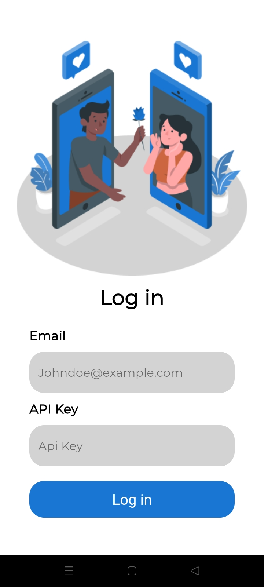
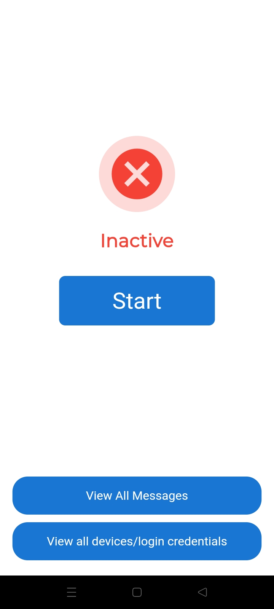
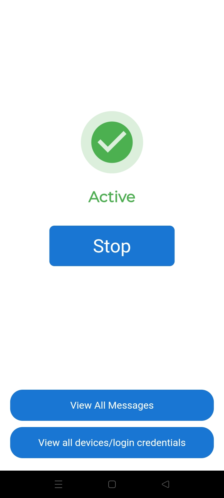
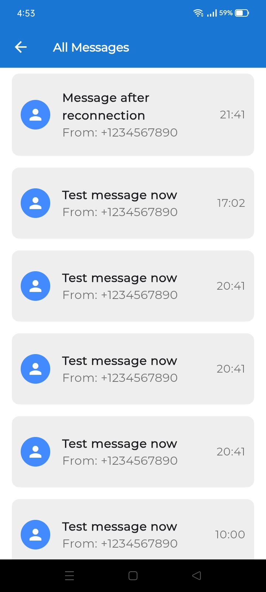
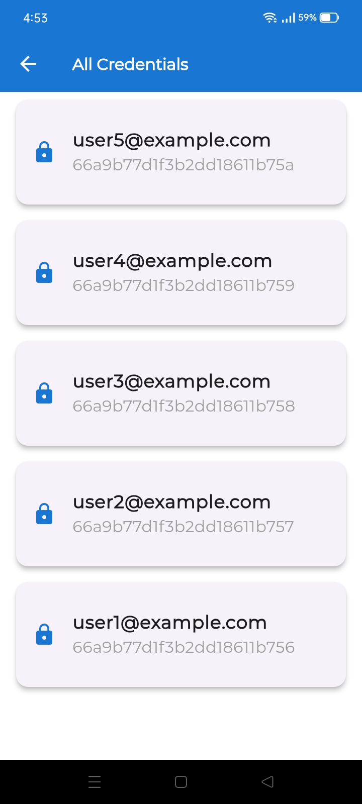

# ZiniPay Task

## Overview
The **ZiniPay Task** is a mobile application developed using Flutter that allows users to authenticate via an API and manage SMS syncing in the background. The app includes a simple user interface with two main pages: a login page and a home page where users can start or stop syncing incoming SMS messages.

## Screenshots
### User Interface
Below are some screenshots of the application:

#### Login and Home Screens
|  |  |  |
|-------------------------------------------|-----------------------------------------------------|-------------------------------------------------|

#### Messages and Credentials Screens
|  |  |
|------------------------------------------------|-----------------------------------------------------|

## Features
1. **Login Page**:
   - Two input fields for email and API key.
   - Authentication via the provided login API.
   - On successful login, the user is redirected to the home page.

2. **Home Page**:
   - A button to start or stop syncing incoming SMS messages in the background.
   - Implements a persistent notification to indicate that SMS syncing is ongoing.
   - Automatically resumes syncing after an internet reconnection.
  
3. **API Integration**:
   - **Login API**: Authenticates users using their email and API key.
     - **Endpoint**: `POST https://demo.zinipay.com/app/auth`
     - **Request Body**:
       ```json
       {
         "email": "user1@example.com",
         "apiKey": "apikey1"
       }
       ```
     - **Success Response**:
       ```json
       {
         "success": true,
         "message": "Authentication successful"
       }
       ```
   - **SMS Sync API**: Sends incoming SMS messages to a specified endpoint.
     - **Endpoint**: `POST https://demo.zinipay.com/sms/sync`
     - **Request Body**:
       ```json
       {
         "message": "Test message now",
         "from": "+1234567890",
         "timestamp": "2024-07-31T10:00:00Z"
       }
       ```
     - **Success Response**:
       ```json
       {
         "success": true,
         "message": "SMS synced successfully."
       }
       ```
   - **Additional Endpoints**: 
     - Retrieve all messages: `GET https://demo.zinipay.com/sms`
     - View all devices/login credentials: `GET https://demo.zinipay.com/devices`

## Background Tasks
The app runs continuously in the background, syncing SMS messages even when closed. It also handles cases where the device loses internet connectivity, queuing messages until the connection is restored.

## Setup Instructions
To run the app locally, follow these steps:

1. **Clone the repository**:
   ```bash
   git clone https://github.com/yourusername/zini_pay_task.git
   cd zini_pay_task
